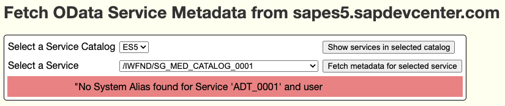
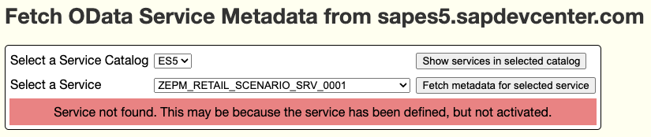

# Minimal App for Reading the Metadata of the Demo OData Services from SAP's Dev Centre Server

A proof-of-concept demo app that calls the OData service `CATALOGSERVICE` on SAP's public Dev Center server.

In this minimal demo scenario, the metadata XML for the selected service is simply returned to the browser as plain text.
This XML can then be saved locally and used by the [`parse-sap-odata`](https://crates.io/crates/parse-sap-odata) crate for building an interface to that OData Service.

## Prerequisites

To access SAP's demmo OData server, you must already have a userid and password for the SAP Dev Center server `sapes5.sapdevcenter.com`.

1. Clone this repo
2. `cd read_sap_odata_catalog`
3. Create a `.env` file containing your SAP DevCenter userid and password and the hostname of the OData server whose service catalog you wish to read.

   ```
   SAP_USER=<your userid>
   SAP_PASSWORD=<your password>
   SAP_CATALOGSERVICE_HOSTNAME=sapes5.sapdevcenter.com
   ```

You could also enter the hostname of your own Gateway server, plus your own logon credentials.

## Limitations

This is a PoC app and has been built with the assumption that the Gateway server will accept basic authentication.
No other authentication methods are currently supported.

# Local Execution

Once the `.env` file has been created, you can start the app using `cargo run`.

Visit <http://localhost:8080> and you will first see a drop down list containing the available catalogs available on this server.
In the case of SAP's Demo OData server `sapes5.sapdevcenter.com`, there is only one service catalog to choose from (`ES5`):


Once you display the services in the selected catalog, you will see:


You can now choose an OData service and display it's metadata.

When building an interface to an OData Service, create your own Rust project that has a build dependency on [`parse-sap-odata`](https://crates.io/crates/parse-sap-odata).

Your project also needs to contain an `/odata` folder within which you have stored this XML in a file called `<service_name>.xml`.

## WARNNING

Just because an OData service is listed in the dropdown, does not mean it can be invoked.
In a Gateway server, it is possible to partially define an OData service!

Consequently, you will see the service name listed, but you will not be able to invoke it.

In order to discover whether or not a service can be invoked, you must attempt to display its service document.

Consequently, you may see error messages such as these:



or


You might also see the HTML of the German "Anmeldung fehlgeschlagen" (Login failed) screen.



Give that this is a PoC app, no attempt has (yet) been made to handle these errors gracefully.
